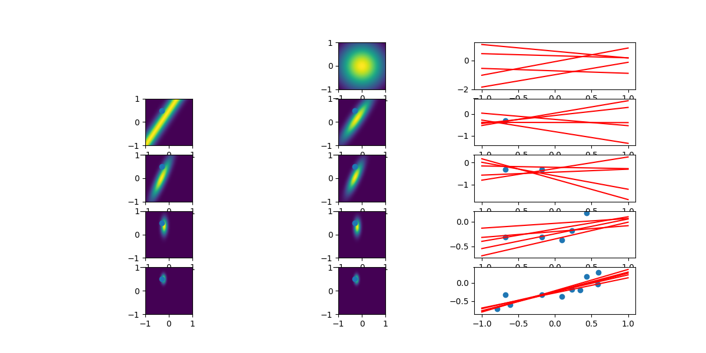

Bayesian linear regression in python. 

This reproduces Figure 3.7 in Pattern Recognition and Machine Learning by Chris Bishop. 
The code snippet below will reproduce the selected Figure. See the text for details. 




```
import numpy as np
import matplotlib.pyplot as plt
import bayesregression as br

data = br.utils.generate_data(10, w = np.array([-0.3, 0.5]))
f = br.plotting.plot_bayesian_linear_regression(data.x, data.y, data.w, alpha = 2.0, beta = (1 / 0.2) ** 2)

f.savefig('bayesplot.png')
```

The example uses generated data similar to that produced within the text of the book.
However, if custom data was to be used, the relevant data tuple needs to be created in leiu of
`utils.generate_data`. However, at present the plots are fixed to w_i = [-1, 1] for the distributions
over the weights. 

```
Data = namedtuple('data', ['x', 'y', 'w'])
    return Data(x = x, y = y, w = w)
```


